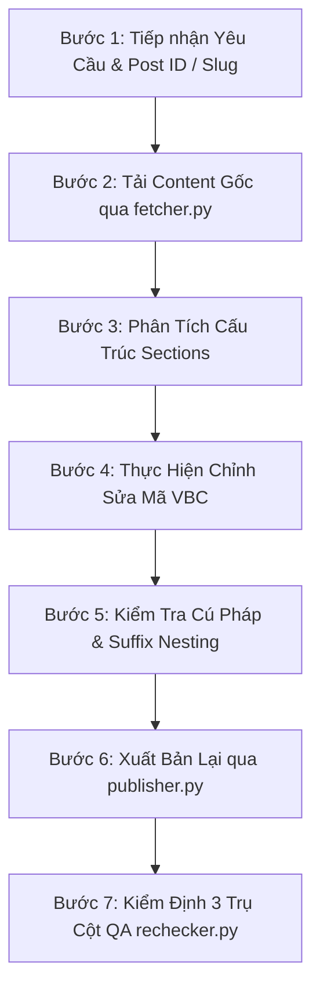

# Quy Trình Chỉnh Sửa Landing Page Với AI Agent (Edit Landing Page Workflow)

Quy trình này hướng dẫn AI Agent tiếp nhận yêu cầu chỉnh sửa, tự động tải mã nguồn VBC Elements gốc từ WordPress REST API, phân tích cấu trúc, thực hiện các thay đổi (thay màu, đổi bố cục, thêm/bớt section, chỉnh sửa trường ACF `[vbc_post]`, tích hợp form...) và xuất bản trở lại mà không làm gãy vỡ layout gốc.

---

## 🚀 QUY TRÌNH 7 BƯỚC THỰC HIỆN



---

### Bước 1: Tiếp Nhận Yêu Cầu & Xác Định Trang Mục Tiêu

1. **Thu thập thông tin trang**:
   - `Post ID` (ví dụ: `2872`, `256`) hoặc `Slug` (ví dụ: `home-beta`, `trang-chu`) hoặc URL trang trực tiếp.
2. **Làm rõ các hạng mục chỉnh sửa**:
   - Sửa phong cách/màu sắc (Ví dụ: Từ nền tối Athletic sang nền sáng Doanh Nghiệp).
   - Thay đổi danh sách sự kiện/bài viết (sử dụng `[vbc_post post_type="..."]`).
   - Thêm/bớt/sắp xếp lại các `[vbc_section]`.
   - Cập nhật thông tin liên hệ, bảng giá, biểu mẫu Contact Form 7.

---

### Bước 2: Tải Nội Dung Shortcodes Gốc Từ WordPress REST API

Sử dụng script `fetcher.py` để tự động kéo toàn bộ nội dung shortcode, custom CSS và metadata của trang về máy:

```bash
# Tải theo Post ID (Khuyên dùng)
python .agents/skills/edit-landingpage/scripts/fetcher.py --post_id <POST_ID> [--output tmp/<slug>/original_vbc.txt]

# Hoặc tải theo Slug
python .agents/skills/edit-landingpage/scripts/fetcher.py --slug "<SLUG>"

# Hoặc tải theo URL
python .agents/skills/edit-landingpage/scripts/fetcher.py --url "<LIVE_URL>"
```

**Kết quả thu được**:
- File shortcodes gốc: `tmp/<slug>/original_vbc.txt`.
- File metadata: `tmp/<slug>/original_vbc_meta.json` (chứa title, slug, template, post_type, custom_css, ux_builder_url).

---

### Bước 3: Phân Tích & Bóc Tách Cấu Trúc Sections Hiện Tại

1. Đọc file `tmp/<slug>/original_vbc.txt` và phân loại từng Section:
   - Header / Navigation Bar (`[vbc_section id="section-nav" ...]`)
   - Hero Section (`[vbc_section id="section-hero" ...]`)
   - Features / Categories / Dynamic Grid (`[vbc_section id="..." ...]`)
   - Spotlight / Value Propositions (`[vbc_section id="..." ...]`)
   - Contact Form / Lead Capture (`[contact-form-7 ...]`)
   - Footer / Copyright (`[vbc_section id="footer-section" ...]`)
2. Xác định chính xác Section nào cần giữ nguyên, Section nào cần sửa đổi, hoặc Section nào cần thêm mới.

---

### Bước 4: Thực Hiện Chỉnh Sửa Mã VBC Elements

Tạo script generator hoặc sửa trực tiếp vào file `tmp/<slug>/edited_vbc.txt`:

1. **Tuân thủ quy tắc VBC Elements**:
   - Dùng `[vbc_section]`, `[row]`, `[col]`, `[vbc_div]`, `[vbc_h1]-[vbc_h6]`, `[vbc_p]`, `[vbc_img]`, `[vbc_icon]`, `[vbc_post]`, `[contact-form-7]`.
   - Khi lồng thẻ `vbc_div`, BẮT BUỘC áp dụng Suffix Nesting: `[vbc_div] -> [vbc_div_inner] -> [vbc_div_inner_1] -> [vbc_div_inner_2]`.
2. **Xử lý `[vbc_post]` cho dữ liệu động**:
   - Khi hiển thị CPT (như `race_event`, `course`, `product`), dùng:
     ```html
     [vbc_post post_type="race_event" posts_per_page="8" columns="4" columns__md="2" columns__sm="1" layout="grid" image_height="190px" title_tag="h3" fields="thumbnail:100%, title:100%, acf:field_race_date:100%, acf:field_race_location:100%, excerpt:100%, button:100%" button_text="Săn BIB Ngay" card_radius="16px"]
     ```
3. **Quy tắc Minify CSS trong `custom_css`**:
   - Toàn bộ CSS trong thuộc tính `custom_css="..."` phải được nén thu gọn (không chứa dòng trống) để ngăn ngừa WordPress `wpautop` chèn thẻ `<br>` làm hỏng giao diện.

---

### Bước 5: Kiểm Tra Tính Hợp Lệ Cú Pháp (Validation)

Chạy kiểm tra cú pháp trước khi xuất bản:
- Đảm bảo tất cả các cặp thẻ mở và đóng cân bằng 100%.
- Không có hiện tượng `Same-Type Nesting` cùng cấp mà không có hậu tố `_inner`.
- Thuộc tính chứa chuỗi HTML (như `text="..."`) chỉ sử dụng dấu nháy đơn `'` bên trong.

---

### Bước 6: Xuất Bản Lại Lên WordPress (Re-Publish)

Đẩy nội dung đã chỉnh sửa lên WordPress, giữ nguyên `post_id` để cập nhật đè lên trang hiện tại:

```bash
python .agents/skills/edit-landingpage/scripts/publisher.py --title "<TITLE>" --slug "<SLUG>" --content "tmp/<slug>/edited_vbc.txt" --post_id <POST_ID>
```

---

### Bước 7: Kiểm Định 3 Trụ Cột QA (3-Pillar Deep Audit)

1. Chạy script `rechecker.py` để kiểm tra toàn diện chất lượng trang web sau chỉnh sửa:
   ```bash
   python .agents/skills/recheck-url/scripts/rechecker.py --url "<LIVE_PAGE_URL>" --post_id <POST_ID>
   ```

2. **Tiêu chuẩn nghiệm thu**:
   - ✅ **VSI Score**: $\ge 90.0\%$.
   - ✅ **Shortcodes chưa parse ngoài DOM**: `0 tags`.
   - ✅ **Lỗi cấu trúc Shortcode DB/API**: `0 lỗi`.
   - ✅ **Hình ảnh rendered đầy đủ**: 100% (không có ảnh rỗng/lỗi).
   - ✅ **Form & Tương tác**: Hoạt động mượt mà, responsive hoàn hảo trên Mobile và Desktop.

3. Cung cấp Live Link và Link chỉnh sửa trực tiếp trên Flatsome UX Builder cho người dùng:
   - `https://<domain>/<slug>/`
   - `https://<domain>/wp-admin/post.php?post=<POST_ID>&action=edit&app=uxbuilder`
