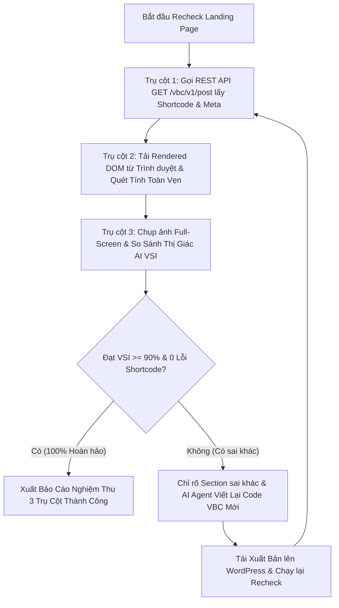

# 🛡️ AI 3-Pillar Deep QA & Visual Comparison Engine

## 🎯 Mục Tiêu & Sứ Mệnh (Mission)
Thực hiện quy trình kiểm thử và nghiệm thu chất lượng Landing Page đa tầng theo **3 Trụ Cột Độc Lập**:
1. **Trụ cột 1 (API Shortcode & Meta Integrity)**: Kiểm tra trực tiếp mã nguồn lưu trong Database qua REST API (`GET /vbc/v1/post?id=...`), đối soát cân bằng thẻ (Tag Balance Stack) và chống lỗi lồng thẻ (`Same-Type Nesting`).
2. **Trụ cột 2 (Browser Rendered DOM & Frontend Aesthetics)**: Quét toàn bộ HTML DOM thực tế do trình duyệt render, xác nhận 0 shortcode thô, 0 thẻ `<style>` hỏng, đủ ảnh, đủ H1/H2, Form CF7, hotline, responsive padding/margin.
3. **Trụ cột 3 (Full-Screen & Section Visual Appearance Comparison)**: So sánh trực quan thị giác giữa ảnh Web Gốc và Web Clone (độ tương đồng VSI $\ge 90.0\%$), tạo bản đồ nhiệt sai khác (Visual Diff Heatmap) và ảnh Side-by-Side.

---

## 🔄 Quy Trình Kiểm Thử 3 Trụ Cột Chi Tiết



---

## 📋 Bảng Tiêu Chí Nghiệm Thu 3 Trụ Cột (Acceptance Criteria)

### 1. Trụ Cột 1: API Shortcode & Meta Integrity (Kiểm tra từ CSDL)
- **100% Dùng thuộc tính `text="..."` tự đóng (Self-closing shortcode)**:
  - CẤM TUYỆT ĐỐI dạng đóng mở có ruột văn bản như `[vbc_p]...[/vbc_p]`, `[vbc_h1]...[/vbc_h1]`, `[vbc_span]...[/vbc_span]`.
  - Phải dùng: `[vbc_p text="..." class="..."]`, `[vbc_h2 text="..."]`. Định dạng `<b>`, `<strong>`, `<span>` phải viết trực tiếp vào `text="..."`.
- **Tag Balance Stack**: 100% các cặp thẻ đóng mở `[vbc_section]`, `[row]`, `[col]`, `[vbc_box]`, `[vbc_block]`, `[vbc_card]`, `[vbc_accordion]` phải cân bằng hoàn hảo.
- **Shortcode Nesting Rule**: Tuyệt đối không lồng `[vbc_div]` trực tiếp bên trong `[vbc_div]` cùng cấp. Luân chuyển linh hoạt giữa `[vbc_box]`, `[vbc_block]`, `[vbc_div]`.
- **Custom CSS Extraction**: Toàn bộ CSS phải được tách vào `_custom_css` / `vbc_page_css` (hoặc `custom_css="..."` của `[vbc_section]`), không chứa thẻ `<style>` lồng bên trong chuỗi CSS thô.
- **Zero Brackets in Attributes**: Tuyệt đối không dùng dấu `[` hoặc `]` bên trong bất kỳ giá trị thuộc tính nào (kể cả `custom_css`).
- **Page Template**: Đảm bảo meta `_wp_page_template` được gán chính xác `page-blank.php`.

### 2. Trụ Cột 2: Rendered DOM & Frontend Aesthetics (Kiểm tra từ Trình duyệt)
- **0 Raw Shortcodes & 0 Text Leaks**:
  - 0 thẻ `[/vbc_div]`, `[row]`, `[col]` thô bị hiển thị ra ngoài màn hình người dùng.
  - 0 rò rỉ mã CSS (`selector .`, `{ width:`), 0 rò rỉ thuộc tính (`class="`, `margin="`), 0 dấu ngoặc đơn lẻ `]` trong text content.
- **0 Corrupted Style Tags**: 0 thẻ `<style>` bị WordPress wpautop tự động chèn `<p>` hoặc `<br>`.
- **Media & Image Integrity**: 100% thẻ `` có `src` hợp lệ, không rỗng, không vỡ ảnh, tỷ lệ khung hình chuẩn.
- **SEO & Content Structure**: Có duy nhất 1 thẻ `<h1>` chất lượng cao, các thẻ `<h2>`, `<h3>` phân cấp rõ ràng.
- **Form CF7 & CTA Buttons**: Có Contact Form 7 hoạt động trơn tru (input padding 12-16px, bo góc 10px, glow focus), nút CTA có hover effect (`translateY(-2px)`).
- **Responsive Layout**: Phân chia cột rõ ràng (`span="6" span__sm="12"`), không có phần tử gây tràn chiều ngang (no overflow-x).

### 3. Trụ Cột 3: Full-Screen & Section Visual Comparison (Đo độ giống thị giác)
- **Visual Similarity Index (VSI) $\ge 90.0\%$** dựa trên công thức trọng số:
  - 40% Color Palette Cosine Similarity (Bảng màu, độ tương phản nền và chữ).
  - 35% Layout Balance (Tỷ lệ phân bố các khối, chiều cao tương quan).
  - 25% Pixel Match (Độ khớp chi tiết các thành phần giao diện).
- **Side-by-Side & Visual Diff Heatmap**: Tự động tạo ảnh đối chiếu trực quan lưu trong `tmp/`.

---

## 💻 Câu Lệnh Thực Thi Recheck

```bash
# Recheck đầy đủ với URL mục tiêu và URL gốc:
python .agents/skills/recheck-url/scripts/rechecker.py --url "<TARGET_URL>" --source_url "<SOURCE_URL>"

# Chỉ định rõ Post ID hoặc file ảnh chụp có sẵn:
python .agents/skills/recheck-url/scripts/rechecker.py --url "<TARGET_URL>" --post_id <POST_ID> --source_url "<SOURCE_URL>" --threshold 90.0
```

---

## 🛠️ Quy Trình Tự Động Khắc Phục Lỗi Bằng AI Agent (Auto-Remediation)
Khi phát hiện bất kỳ lỗi nào ở 1 trong 3 trụ cột:
1. Đọc báo cáo chi tiết tại `tmp/recheck_visual_ai_report.md`.
2. Xác định chính xác Section và dòng shortcode gây lỗi (ví dụ: mất cân bằng thẻ, thiếu ảnh, chữ chìm màu nền).
3. Viết lại mã nguồn hoàn chỉnh của Section đó trong script `tmp/gen_<slug>.py` hoặc file `tmp/<slug>/compiled_vbc.txt`.
4. Gọi `publisher.py` cập nhật lên WordPress qua REST API `/vbc/v1/post`.
5. Chạy lại `rechecker.py` cho đến khi đạt thông số: **VSI $\ge 90.0\%$**, **0 shortcode errors**, **0 unparsed tags**.
