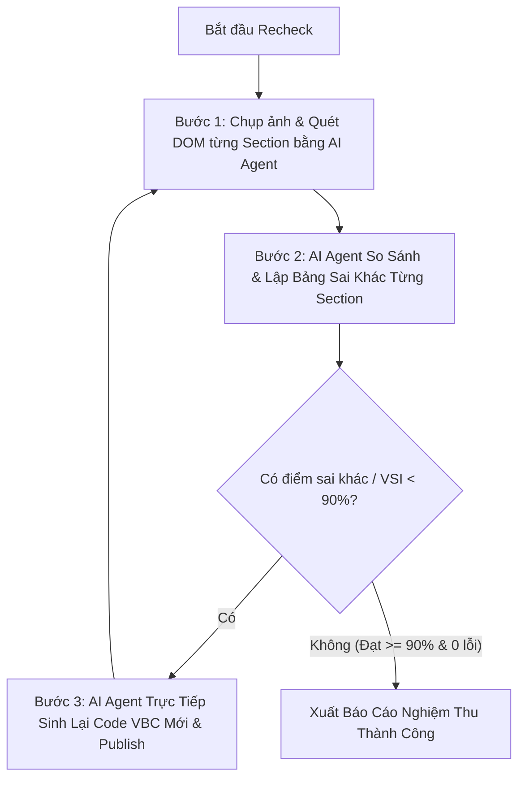

# AI Visual Quality Assurance & Section-by-Section Recheck Engine

## Mục tiêu (Goal)
Sử dụng **AI Agent** kết hợp công cụ chụp ảnh và phân tích đa chiều để **so sánh chi tiết từng Section (Section-by-Section Gap Analysis)** giữa trang Web Gốc (Source) và Web Clone (Target). Đo lường chỉ số tương đồng thị giác (Visual Similarity Index - VSI $\ge 90\%$), phát hiện mọi điểm sai khác về bố cục, màu sắc, typography, hình ảnh, sau đó **tự động yêu cầu AI Agent sinh lại mã nguồn VBC mới** để khắc phục triệt để.

---

## 🔄 Quy Trình Recheck 3 Bước Chặt Chẽ (Workflow)



### Bước 1: Thu thập Hình ảnh & DOM Từng Section (Section Inspection)
- Sử dụng `browser_subagent` chụp ảnh toàn trang (`CaptureBeyondViewport: true`) và chụp chi tiết từng Section trọng điểm:
  - **Section 1 (Hero / Banner)**: Tiêu đề H1, cụm ảnh/video, card thông tin tóm tắt, nút CTA.
  - **Section 2 (Mục tiêu / Tính năng)**: Bố cục lưới các thẻ mục tiêu, icon, chữ in đậm.
  - **Section 3 (Hỏi đáp FAQ)**: Accordion câu hỏi, màu chữ tiêu đề, icon toggle, độ tương phản.
  - **Section 4 (Lợi thế / Khác biệt)**: Bố cục lưới 2x2 hoặc 4 cột, số thứ tự `01-04`, icon minh họa 3D, danh sách checklist tích xanh.
  - **Section 5 (Học viên / Đánh giá)**: Cấu trúc lưới ảnh học viên (1 ảnh lớn + lưới nhỏ bên cạnh), trích dẫn phụ huynh, nút CTA học thử.
  - **Section 6 (Đội ngũ Giáo viên)**: Khối giới thiệu bên trái + Lưới avatar tròn giáo viên có viền màu, tên, quốc tịch, link chi tiết.
  - **Section 7 (Truyền thông & Báo chí)**: Hàng logo báo chí căn giữa, hiệu ứng hover phóng to/đổi màu.
  - **Section 8 (Giải thưởng / Chứng nhận)**: Khối thẻ giải thưởng có icon cúp/huân chương trên nền màu nhẹ.
  - **Section 9 (Form Đăng Ký Tư Vấn)**: Bố cục 2 cột (Cột 1: Thông điệp cam kết + checklist tích xanh; Cột 2: Form Contact Form 7 với input bo tròn, focus glow và nút submit nổi bật).

---

### Bước 2: AI Agent So Sánh Chi Tiết Từng Section (Gap Analysis)
AI Agent lập bảng đối soát chi tiết từng Section dựa trên 5 tiêu chí:

| Tiêu chí đối soát | Nội dung kiểm tra chi tiết | Trạng thái chấp thuận |
|---|---|---|
| **1. Bố cục & Lưới (Layout & Grid)** | Phân chia cột Flatsome `[row]` + `[col]`, tỷ lệ bề rộng (`custom_width`), khoảng cách padding, margin, căn lề. | Khớp 1:1 với web mẫu |
| **2. Typography & Phân cấp chữ** | Kích thước font chữ, màu sắc, font-weight (700/800 cho Heading), line-height, độ tương phản chữ không bị chìm nền. | Rõ nét, chuẩn màu |
| **3. Hình ảnh & Icons** | Số lượng ảnh, tỷ lệ khung hình, bo góc (`border_radius`), bóng đổ mềm (`box_shadow`), icon SVG/PNG sắc nét. | 100% hiển thị đủ, không vỡ |
| **4. Thành phần tương tác** | Nút CTA bo tròn viên thuốc, hiệu ứng hover (`translateY(-2px)`), accordion đóng/mở mượt mà. | Mượt mà, trực quan |
| **5. Form Đăng ký & CF7** | Label rõ ràng, input padding 12-16px, bo góc 10px, background `#f8fafc`, focus viền màu chủ đạo, button submit full-width. | Đẹp, validate chuẩn |

---

### Bước 3: Tự Động Yêu Cầu AI Agent Sinh Lại Code Mới (Auto-Remediation)
- **BẮT BUỘC**: Nếu phát hiện bất kỳ Section nào có bố cục sai lệch, chữ bị chìm màu, hình ảnh bị méo/kéo dài, hoặc VSI $< 90\%$:
  1. AI Agent **phải chỉ ra chính xác sai khác ở Section nào** (ví dụ: *"Section FAQ bị chữ trắng chìm trên nền hồng"* hoặc *"Section Lợi thế bị xếp dọc 4 card khổng lồ"*).
  2. AI Agent **viết lại toàn bộ code của Section đó (hoặc file generator `gen_<slug>.py`)** với chuẩn 100% `[vbc_section id="..." custom_css="..."]`.
  3. Tái xuất bản lên WordPress và chạy lại vòng Recheck để nghiệm thu.

---

## 💻 Thực Thi Script Rechecker

Chạy script đối soát tự động:
```bash
python .agents/skills/recheck-url/scripts/rechecker.py --url "<TARGET_URL>" --source_url "<SOURCE_URL>" [--threshold 90.0]
```

## 📊 Tiêu Chí Nghiệm Thu (Acceptance Criteria)
1. **Độ tương đồng thị giác (VSI) $\ge 90.0\%$**.
2. **0 Shortcodes chưa parse** (không có `[/vbc_div]`, `[row]`, `[col]` thô).
3. **0 Thẻ style bị lỗi**.
4. **Tất cả hình ảnh hiển thị 100%**, không có link ảnh rỗng hay lỗi 404.
5. **Đầy đủ thẻ H1 SEO & Contact Form 7 hoạt động trơn tru**.
