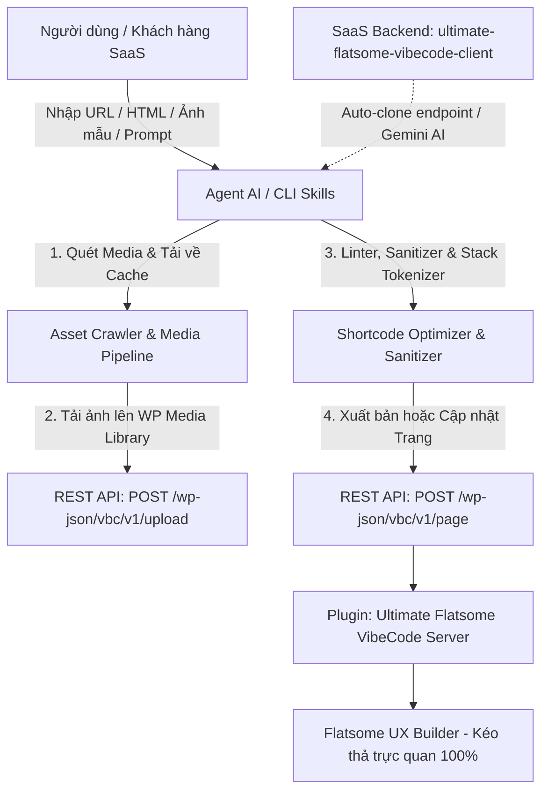
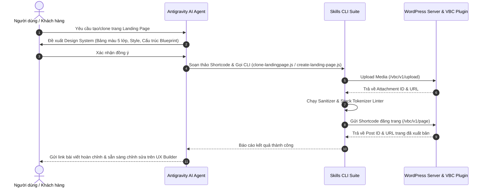

# Hệ Sinh Thái Ultimate Flatsome VibeCode — Kiến Trúc & Tài Liệu Toàn Diện

> **Tài liệu tổng hợp & phân tích kỹ thuật toàn diện về hệ thống Ultimate Flatsome VibeCode (WordPress Plugin, AI Agent CLI Skills, và Nền tảng SaaS).**

---

## 🎯 1. Tầm Nhìn & Mô Hình Tổng Thể Của Hệ Thống

Hệ thống **Ultimate Flatsome VibeCode** là một hệ sinh thái kết hợp giữa **WordPress Plugin mở rộng UX Builder**, **Agent AI CLI Skills** và **Nền tảng SaaS** nhằm giải quyết bài toán:

> **Tạo mới và Clone mọi giao diện Landing Page về Flatsome UX Builder đạt độ chính xác 99% (Pixel-Perfect), đồng thời bảo toàn trọn vẹn khả năng kéo-thả, chỉnh sửa trực quan trong UX Builder.**



---

## 🧩 2. Cấu Trúc Các Thành Phần Chính Trong Workspace

Hệ thống được chia thành 3 cấu phần lõi và 1 thư mục dữ liệu mẫu:

```
ultimate-flatsome-vibecode/
├── ultimate-flatsome-vibecode/         # [1] Plugin WordPress cốt lõi (v2.3.0 Modular Architecture)
│   ├── assets/                         # CSS, JS Icon Picker, hình ảnh demo
│   │   ├── vbc-icon-picker.js          # Modal chọn Icon & Media cho UX Builder
│   │   └── vbc-icon-picker.css         # Styling cho Modal Icon Picker
│   ├── includes/                       # Kiến trúc module hóa tách biệt
│   │   ├── class-vbc-core.php          # Singleton Loader & Bootstrap
│   │   ├── core/                       # CSS Engine & Responsive Compiler
│   │   ├── elements/                   # UX Builder Schemas & HTML Shortcodes
│   │   │   └── components/             # Card, Testimonial, Accordion, Tabs, Button, Slider, Fullpage, Post
│   │   ├── icons/                      # Quản lý 5 bộ icon & lazy loading
│   │   ├── api/                        # REST API (/upload, /page, /cf7)
│   │   ├── admin/                      # Admin Settings & Project Exporter (Zip đệ quy)
│   │   └── optimizations/              # Tắt WP Emoji, dọn HTML rác
│   ├── skills/                         # Thư mục Skills đóng gói theo chuẩn Google Antigravity
│   └── ultimate-flatsome-vibecode.php  # Entrypoint bootstrap plugin
│
├── .agents/skills/                     # [2] Bộ công cụ AI Skills chuẩn Google Antigravity (Source of Truth)
│   ├── clone-landingpage/              # Skill tự động clone 99%
│   ├── create-landingpage/             # Skill tạo landing page mới
│   ├── recheck-url/                    # Skill QA audit và đo độ giống
│   └── vbc-elements/                   # Cẩm nang tra cứu VBC Shortcodes
│
├── vbc-config.sample.json              # [3] Mẫu file cấu hình API Token & FTP
├── ultimate-flatsome-vibecode-client/  # [4] Phần mở rộng SaaS Private (AI Backend Gemini)
└── Example/                            # [5] Dữ liệu mẫu & Fixtures kiểm thử
```

---

## 🛠️ 3. Chi Tiết Kỹ Thuật Từng Thành Phần

### 3.1. Plugin Cốt Lõi (`ultimate-flatsome-vibecode`)

Chạy trên website WordPress đích với các nhiệm vụ chính:

1. **Hệ thống Phần Tử UX Builder Toàn Diện (`vbc_` Shortcodes)**:
   * **Nhóm Container**: `[vbc_div]`, bí danh `[vbc_box]`, `[vbc_block]`, `[vbc_container]`, `[vbc_p]`, `[vbc_span]`, `[vbc_a]`, `[vbc_h1]`...`[vbc_h6]`, `[vbc_ul]`, `[vbc_ol]`, `[vbc_li]`, `[vbc_table]`, `[vbc_tr]`, `[vbc_td]`, `[vbc_th]`, `[vbc_b]`, `[vbc_strong]`, `[vbc_em]`, `[vbc_u]`.
   * **Nhóm Void (Tự đóng)**: `[vbc_img]`, `[vbc_hr]`, `[vbc_br]`.
   * **Nhóm UI Components cao cấp**:
     * `[vbc_card]`: Hỗ trợ hiệu ứng Glassmorphism mờ 16px, viền sáng và glow hover.
     * `[vbc_testimonial]`: Khối đánh giá khách hàng chuẩn CRO, tích hợp đánh giá sao và avatar.
     * `[vbc_accordion]` & `[vbc_accordion_item]`: Accordion hỏi đáp tích hợp chuẩn Schema FAQ SEO.
     * `[vbc_button]`: Nút bấm chuyển đổi cao (danger gradient, glassmorphism, custom styling).
     * `[vbc_slider]` & `[vbc_slide]`: Tích hợp thư viện Splide.js mượt mà.
     * `[vbc_fullpage]`: Trình cuộn trang Section từng màn hình với fullPage.js.

2. **Trình Biên Dịch CSS Responsive & Bộ Lọc Tự Động Inline**:
   * Hỗ trợ thuộc tính responsive: Desktop, Tablet (`__md` ở 849px), Mobile (`__sm` ở 549px).
   * Tự động sinh CSS Class ngẫu nhiên `vbc-css-xxxxxxxx` tránh trùng lặp style.
   * Cơ chế **Dynamic CSS Loading**: Tự động gom CSS và in ở `wp_footer` / `admin_footer` khi duyệt frontend, hoặc tự động render inline `<style>` khi đang preview trong iframe của UX Builder.

3. **Bộ Chọn Icon & Media Hiện Đại ([vbc-icon-picker.js](file:///f:/DEV/ultimate-flatsome-vibecode/ultimate-flatsome-vibecode/assets/vbc-icon-picker.js))**:
   * Tích hợp 5 bộ icon vector hàng đầu: **Lucide, FontAwesome 6, Remix Icon, Phosphor Icons, Google Material Symbols**.
   * Tab tải và chọn ảnh trực tiếp từ WP Media Library.
   * Cơ chế **Selective Lazy Loading**: Chỉ nạp file CSS/JS của đúng bộ icon được sử dụng trên trang, loại bỏ tải tài nguyên thừa.
   * Tự động vô hiệu hóa emoji mặc định của WordPress (`s.w.org`) để tăng tốc độ load trang.

4. **Hệ Thống REST API Xác Thực Token**:
   * `POST /wp-json/vbc/v1/upload`: Upload ảnh an toàn, hỗ trợ cả định dạng SVG.
   * `POST|GET /wp-json/vbc/v1/page`: Đăng trang mới hoặc cập nhật trang hiện có theo ID/Slug kèm gán template trang trắng (`page-blank.php`).
   * Xác thực bằng User Token (`vbc_api_token`) được quản lý trực tiếp trong trang chỉnh sửa User WordPress.

---

### 3.2. Hệ Thống Antigravity Agent Skills (Chuẩn Google Codelabs)

Bộ Skills tuân thủ 100% đặc tả **Google Antigravity Skills** (`.agents/skills/`), hỗ trợ cơ chế nạp động theo nhu cầu (**Progressive Disclosure**) và phân tách thành 4 module độc lập:

1. **`clone-landingpage`** (`.agents/skills/clone-landingpage/`):
   * **Runbook:** `SKILL.md` (YAML Frontmatter + Quy trình phân tích DOM & đồng bộ Media).
   * **Script lõi:** `scripts/cloner.py` (Generic Cloner 100% tự động).
   * **Tài liệu tham khảo:** `references/dom-pattern-guide.md`, `references/vbc-mapping-rules.md`.
   * **Ví dụ mẫu:** `examples/sample-landing-page.vbc`.

2. **`recheck-url`** (`.agents/skills/recheck-url/`):
   * **Runbook:** `SKILL.md` (Quy trình kiểm thử chất lượng QA Audit & chụp ảnh 1-shot).
   * **Script lõi:** `scripts/rechecker.py` (Động cơ so sánh thị giác AI & Histogram VSI $\ge 90\%$).
   * **Tài liệu tham khảo:** `references/audit-criteria.md`.
   * **Ví dụ mẫu:** `examples/sample-audit-report.md`.

3. **`create-landingpage`** (`.agents/skills/create-landingpage/`):
   * **Runbook:** `SKILL.md` (Quy trình kiến tạo Landing Page chuyển đổi cao từ Prompt/Wireframe).
   * **Script lõi:** `scripts/generator.py` (Trình sinh shortcode VBC).
   * **Tài liệu tham khảo:** `references/section-templates.md`.

4. **`vbc-elements`** (`.agents/skills/vbc-elements/`):
   * **Cẩm nang tra cứu:** `SKILL.md`, `references/shortcodes-catalog.md`, `references/responsive-css-guide.md`.
   * **Ví dụ mẫu:** `examples/modern-hero-section.vbc`.

---

### 3.3. Phần Mở Rộng Dịch Vụ SaaS (`ultimate-flatsome-vibecode-client`)

Là mô hình kinh doanh SaaS phục vụ người dùng cuối:
* Tích hợp API Endpoint `POST /wp-json/vbc/v1/auto-clone` dùng **Gemini AI API Key**.
* Giao diện SaaS cho phép khách hàng dán link website bất kỳ hoặc ảnh mẫu $\rightarrow$ Backend AI phân tích và dựng layout Flatsome VibeCode $\rightarrow$ Khách hàng xem thử và bấm tải về gói ZIP hoặc bấm **"Nhập trang từ SAAS"** trực tiếp từ website của họ.

---

## 🚫 4. Danh Sách Quy Tắc Bắt Buộc & Chống Lỗi (Anti-Patterns Matrix)

| Anti-Pattern (Hành vi bị cấm) | Hậu quả kỹ thuật | Giải pháp chuẩn VibeCode |
|---|---|---|
| ❌ **Dùng Emoji Unicode thô (🔥, ⚡, 🚨)** | WordPress core tự biến thành ảnh SVG `s.w.org` xấu và làm chậm trang | Luôn dùng `[vbc_icon pack="lucide" name="..."]` |
| ❌ **Hardcode `font-family` trong shortcode** | Gây lỗi hiển thị tiếng Việt có dấu, mất đồng bộ với Flatsome | Để trống `font-family`, để trang tự kế thừa font toàn cục từ Flatsome Customizer |
| ❌ **Lồng `[row]` bên trong `[col]`** | Vỡ bộ phân tích shortcode của Flatsome và lộ thẻ đóng | Dùng CSS Grid `display: grid; grid-template-columns: 1fr 1fr; gap: 16px;` |
| ❌ **Lồng 2 thẻ shortcode cùng tên** | WordPress parser làm lộ thẻ đóng ra frontend | Tuân thủ thứ bậc bí danh (`vbc_div` $\rightarrow$ `vbc_box` $\rightarrow$ `vbc_block` $\rightarrow$ `vbc_container`) hoặc dùng hậu tố `_inner` |
| ❌ **Khai báo thuộc tính Flex trần** | Không được render ra CSS inline | Khai báo trong `custom_css="selector { display: flex; align-items: center; gap: 12px; }"` |
| ❌ **Dùng `href="..."` thay vì `link_url="..."`** | Thẻ `[vbc_a]` bị mất link | Luôn dùng `[vbc_a link_url="..." link_target="_blank"]` |

---

## 🔄 5. Quy Trình Phối Hợp Làm Việc Chuẩn (Standard Workflow)



---

## 📌 6. Tóm Tắt Trạng Thái Hệ Thống

Hệ sinh thái hiện đã hoàn thiện nền tảng kỹ thuật cốt lõi:
1. ✅ **Plugin Server**: Đầy đủ elements, responsive compiler, icon picker modal, REST API token.
2. ✅ **CLI Skills Suite**: Đầy đủ bộ phân giải, AST sanitizer, media crawler và auto publisher.
3. ✅ **Design Intelligence**: Đã đóng gói 6 Style thiết kế, bảng màu 5 lớp và 3 Conversion CRO Blueprints.
4. 🔄 **SaaS Client Backend**: Sẵn sàng kết nối mở rộng thêm endpoint AI Auto-Clone tự động qua Gemini API.