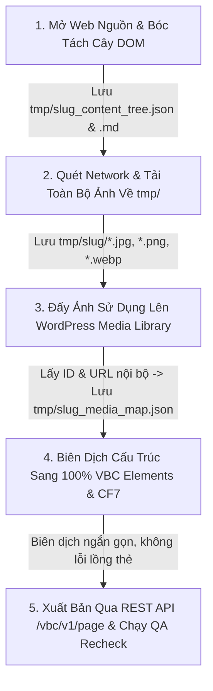

# Clone Landing Page Skill (`clone-landingpage.py`)

## 1. Giới Thiệu
Skill **`clone-landingpage.py`** dùng để clone bất kỳ trang web nào về WordPress với độ tương đồng về hình ảnh, giao diện, nội dung, layout và icon từ **90% đến 100%**, đảm bảo:
- **100% Nội dung thật theo Cây DOM (Không bịa đặt / Zero Hallucination)**.
- **Toàn bộ tài nguyên ảnh tải về thư mục `tmp/` của dự án, đẩy lên WordPress lấy ID gắn vào Shortcode**.

---

## 2. Quy Trình Hoạt Động Chuẩn (5-Step Master Flow)



### Chi tiết từng bước trong Flow:

### **Bước 1: Bóc Tách Toàn Bộ Text Theo Cây DOM Phân Cấp (Semantic Tree Extraction)**
- Mở trang web nguồn và phân tích cấu trúc DOM phân cấp theo từng `<section>`, `<header>`, `<footer>`, `<article>`.
- Trích xuất chính xác 100% các thẻ nội dung:
  - **Headings**: `<h1>`, `<h2>`, `<h3>`, `<h4>`, `<h5>`, `<h6>`
  - **Văn bản & Đoạn văn**: `<p>`, `<span>`, `<b>`, `<strong>`, `<em>`, `<blockquote>`
  - **Danh sách**: `<ul>`, `<ol>`, `<li>`
  - **Liên kết & Nút bấm**: `<a>`, `<button>` (kèm `href` và `target`)
  - **Biểu mẫu**: `<form>`, `<input>`, `<textarea>`, `<select>`
- Tự động lưu cây phân cấp nội dung ra:
  - `tmp/{slug}/{slug}_content_tree.json` (Machine-readable cho script)
  - `tmp/{slug}/{slug}_content_tree.md` (Human-readable để kiểm tra đối soát)
- **Đảm bảo nội dung trang mới trùng khớp 100% với bản gốc, không tự bịa đặt nội dung**.

---

### **Bước 2: Quét Network & Tải Toàn Bộ Ảnh Vào Thư Mục `tmp/` Của Dự Án**
- Quét toàn bộ nguồn ảnh:
  - Thẻ `` (`src`, `data-src`, `data-lazy-src`, `srcset`)
  - CSS inline & external `background-image: url(...)`
  - Thẻ `<picture><source>`
  - Favicon, Logo, Vector SVG
- Tự động tải tất cả các tệp hình ảnh hợp lệ (`.jpg`, `.jpeg`, `.png`, `.webp`, `.svg`, `.gif`, `.ico`) về thư mục cục bộ:
  `tmp/{slug}/` (hoặc cấu hình tùy chọn qua `--tmp_dir`).
- Ghi nhận trạng thái và đường dẫn local của từng file.

---

### **Bước 3: Đẩy Ảnh Lên WordPress Media Library & Lấy ID Gắn Vào Shortcode**
- Khi dựng giao diện và tạo shortcode, các ảnh được sử dụng sẽ được đẩy lên WordPress qua REST API:
  `POST /wp-json/vbc/v1/upload` (Xác thực qua header `X-VBC-Token`).
- Nhận kết quả phản hồi từ WordPress gồm:
  - **Attachment ID**: `id` (ví dụ `512`)
  - **Internal CDN URL**: `url` (ví dụ `https://domain/wp-content/uploads/2026/08/banner.png`)
- Gắn trực tiếp `img_attachment="ID"` và `src="URL"` vào các phần tử VBC:
  ```html
  [vbc_img img_source="manual" img_attachment="512" src="https://domain/wp-content/uploads/.../banner.png" alt="..."]
  ```
- Lưu lại bản đồ liên kết Media Map hoàn chỉnh tại:
  `tmp/{slug}/{slug}_media_map.json`

---

### **Bước 4: Chuyển Đổi Form Biểu Mẫu Sang Contact Form 7**
- Tự động phát hiện các khối `<form>` trên trang nguồn.
- Tự động phân tích các trường `input`, `tel`, `email`, `textarea`, `select` và tạo Contact Form 7 tương ứng qua REST API:
  `POST /wp-json/vbc/v1/cf7`
- Nhận về mã shortcode:
  `[contact-form-7 id="508" title="Form Đăng Ký"]` và thay thế vào vị trí form tương ứng.

---

### **Bước 5: Biên Dịch Sang VBC Elements, Xuất Bản & Kiểm Định QA**
- Biên dịch toàn bộ layout sang 100% phần tử VBC (`[vbc_div]`, `[vbc_box]`, `[vbc_block]`, `[vbc_container]`, `[vbc_icon]`, `[vbc_p]`, `[vbc_a]`...) theo đúng chuẩn phân cấp để chống lỗi lồng shortcode của WordPress.
- Xuất bản trang lên WordPress qua REST API:
  `POST /wp-json/vbc/v1/page` (Template: `page-blank.php`).
- Tự động gọi script kiểm định QA **`recheck-url.py`** để quét trực tiếp frontend live:
  - Quét 0 unparsed shortcodes.
  - Quét tính toàn vẹn của thẻ `<style>` và hình ảnh.
  - Đảm bảo điểm số đạt **100/100%**.

---

## 3. Hướng Dẫn Sử Dụng CLI

### A. Clone một trang web bất kỳ:
```bash
python skills/clone-landingpage.py --url "https://nihaoma-mandarin.com/vi/trang-chu/" --title "Ni Hao Ma Mandarin Learning Lab" --slug "ni-hao-ma"
```

### B. Clone và cập nhật vào Post ID có sẵn:
```bash
python skills/clone-landingpage.py --url "https://nihaoma-mandarin.com/vi/trang-chu/" --post_id 502 --title "Ni Hao Ma Mandarin Learning Lab"
```

### C. Tùy chỉnh thư mục lưu trữ ảnh tạm `tmp/`:
```bash
python skills/clone-landingpage.py --url "https://example.com" --tmp_dir "tmp/custom_landing"
```

---

## 4. Bảng Tham Số CLI

| Tham Số | Bắt Buộc | Mặc Định | Ý Nghĩa |
| :--- | :---: | :---: | :--- |
| `--url` | **Có** | - | URL trang web gốc cần clone |
| `--title` | Không | `Landing Page Clone` | Tiêu đề trang trên WordPress |
| `--slug` | Không | Tự động sinh từ Title | Slug đường dẫn của trang |
| `--post_id` | Không | `None` | Post ID cần ghi đè cập nhật (nếu có) |
| `--template` | Không | `page-blank.php` | Page template WordPress sử dụng |
| `--max_images` | Không | `60` | Số lượng ảnh tối đa tải về `tmp/` và sync lên WP |
| `--tmp_dir` | Không | `tmp/{slug}` | Đường dẫn thư mục lưu ảnh và cây nội dung |
| `--no_recheck` | Không | `False` | Tắt tự động chạy QA recheck sau khi xuất bản |
| `--config` | Không | Tự tìm | Đường dẫn file `vbc-config.json` tùy chỉnh |

---

## 5. Cấu Trúc Thư Mục Tạo Ra Trong `tmp/`

Sau khi chạy lệnh clone, toàn bộ dữ liệu trung gian được tổ chức gọn gàng trong thư mục `tmp/{slug}/`:
```
tmp/
└── {slug}/
    ├── {slug}_content_tree.json     # Cây DOM dữ liệu có cấu trúc h1, h2, p, a...
    ├── {slug}_content_tree.md       # Bản tóm tắt cây nội dung trực quan
    ├── {slug}_media_map.json        # Bản đồ ánh xạ URL gốc -> file local -> WP URL & Attachment ID
    ├── {slug}_vbc_content.txt       # Toàn bộ mã nguồn shortcode VBC hoàn chỉnh
    ├── banner-main.jpg              # Ảnh tải từ network
    ├── teacher-1.png                # Ảnh tải từ network
    └── logo.png                     # Ảnh tải từ network
```
