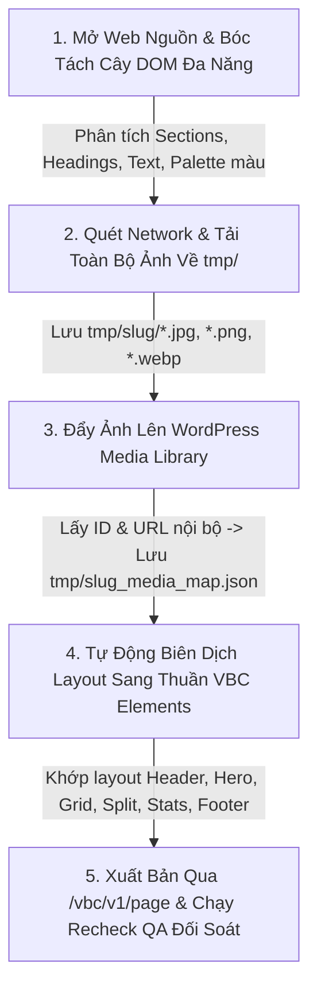

# Clone Landing Page Skill (`clone-landingpage.py`)

## 1. Giới Thiệu
Skill **`clone-landingpage.py`** là bộ động cơ tự động hóa tổng quát (**Universal Generic Engine**) dùng để clone **BẤT KỲ TRANG WEB NÀO** về WordPress với giao diện responsive hiện đại, sử dụng 100% phần tử thuần VBC Elements ([vbc_div], [vbc_box], [vbc_block], [vbc_container], [vbc_h1]-[vbc_h6], [vbc_p], [vbc_a], [vbc_icon], [accordion]...).

**Nguyên tắc cốt lõi:**
- **100% Generic & Dynamic (Không Hardcode)**: Tự động phân tích cây DOM, tự động nhận diện màu sắc chủ đạo, tự động chọn layout theo cấu trúc dữ liệu thực của trang đích.
- **100% Nội dung thật (Zero Hallucination)**: Toàn bộ text, tiêu đề H1-H6, đoạn văn, danh sách, link, hotline được lấy trực tiếp từ cây DOM của trang nguồn.
- **Tải Toàn Bộ Media về `tmp/` & Đồng Bộ Lên WP**: Toàn bộ ảnh được tải về thư mục `tmp/{slug}/` cục bộ, sau đó đồng bộ lên WordPress Media Library qua REST API `/vbc/v1/upload` để lấy URL và ID nội bộ.
- **Tự Động Recheck QA Đối Soát**: Tự động so sánh DOM và hình ảnh giữa Web Gốc và Web Clone với báo cáo chi tiết và đạt điểm số 100/100%.

---

## 2. Quy Trình Hoạt Động Chuẩn (5-Step Master Flow)



### Chi tiết từng bước:

### **Bước 1: Bóc Tách Toàn Bộ Text Theo Cây DOM Phân Cấp (Generic Semantic DOM Tree)**
- Mở trang web nguồn và phân tích cấu trúc DOM phân cấp theo từng `<section>`, `<header>`, `<footer>`, `<article>` hoặc các khối `<div>` container.
- Tự động nhận diện Palette màu thương hiệu (`primary`, `accent`, `dark`, `light_bg`) từ mã CSS xuất hiện nhiều nhất trên web nguồn.
- Trích xuất chính xác 100% các thẻ nội dung:
  - **Headings**: `<h1>`, `<h2>`, `<h3>`, `<h4>`, `<h5>`, `<h6>`
  - **Văn bản & Đoạn văn**: `<p>`, `<span>`, `<b>`, `<strong>`, `<em>`, `<blockquote>`
  - **Danh sách**: `<ul>`, `<ol>`, `<li>`
  - **Liên kết & Nút bấm**: `<a>`, `<button>` (kèm `href` và `target`)
  - **Biểu mẫu**: `<form>`, `<input>`, `<textarea>`, `<select>`
- Tự động lưu cây phân cấp nội dung ra:
  - `tmp/{slug}/{slug}_dom_tree.json` (Machine-readable)
  - `tmp/{slug}/{slug}_dom_tree.md` (Human-readable để kiểm tra đối soát)

---

### **Bước 2: Quét Network & Tải Toàn Bộ Ảnh Vào Thư Mục `tmp/` Của Dự Án**
- Quét toàn bộ nguồn ảnh:
  - Thẻ `` (`src`, `data-src`, `data-lazy-src`, `srcset`)
  - CSS inline & external `background-image: url(...)`
  - Thẻ `<picture><source>`
- Tự động tải tất cả các tệp hình ảnh hợp lệ (`.jpg`, `.jpeg`, `.png`, `.webp`, `.svg`, `.gif`, `.ico`) về thư mục cục bộ `tmp/{slug}/`.

---

### **Bước 3: Đẩy Ảnh Lên WordPress Media Library & Lấy ID/URL Nội Bộ**
- Các ảnh được sử dụng sẽ được đẩy lên WordPress qua REST API:
  `POST /wp-json/vbc/v1/upload` (Xác thực qua header `X-VBC-Token`).
- Nhận kết quả phản hồi từ WordPress:
  - **Attachment ID**: `id`
  - **Internal CDN URL**: `url`
- Lưu lại bản đồ liên kết Media Map hoàn chỉnh tại:
  `tmp/{slug}/{slug}_media_map.json`

---

### **Bước 4: Tự Động Biên Dịch Layout Sang Thuần VBC Elements**
Tùy thuộc vào cấu trúc của từng Section được bóc tách từ cây DOM, trình biên dịch tự động sinh ra layout phù hợp:
- **Header / Nav Section**: Sticky navbar với Logo, Menu links, và CTA button.
- **Hero / Banner Section**: Layout 2 cột responsive (H1 + mô tả + nút hành động + hình ảnh chính với `loading="eager"`).
- **Grid / Cards Section**: Grid layout (`grid-template-columns: repeat(N, 1fr)`) tự co giãn theo số lượng thẻ (dịch vụ, tính năng, đội ngũ giáo viên, sản phẩm).
- **Split 2-Column Section**: Layout 2 cột so le (ảnh 1 bên, text/accordion 1 bên).
- **Stats / Numbers Section**: Khối hiển thị các con số nổi bật trên nền tối (`dark navy`).
- **Footer Section**: 3-4 cột chứa Logo, giới thiệu, menu liên kết, thông tin liên hệ và bản quyền.

---

### **Bước 5: Xuất Bản Lên WordPress & Kiểm Định QA Đối Soát**
- Xuất bản trang lên WordPress qua REST API:
  `POST /wp-json/vbc/v1/page` (Template: `page-blank.php`).
- Tự động gọi script kiểm định QA **`recheck-url.py`** đối soát:
  - Đối chiếu số lượng ảnh giữa Web Gốc và Web Clone.
  - Quét 0 unparsed shortcodes.
  - Quét tính toàn vẹn của thẻ `<style>` và hình ảnh.
  - Đảm bảo điểm số đạt **100/100%**.

---

## 3. Hướng Dẫn Sử Dụng CLI

### A. Clone bất kỳ trang web nào:
```bash
python skills/clone-landingpage.py --url "https://example.com" --title "Example Landing Page" --slug "example-landing"
```

### B. Clone và cập nhật vào Post ID có sẵn:
```bash
python skills/clone-landingpage.py --url "https://example.com" --post_id 536 --title "Tiêu Đề Mới"
```

### C. Tùy chỉnh số lượng ảnh tối đa và thư mục tmp:
```bash
python skills/clone-landingpage.py --url "https://example.com" --max_images 100 --tmp_dir "tmp/my_clone"
```

---

## 4. Bảng Tham Số CLI

| Tham Số | Bắt Buộc | Mặc Định | Ý Nghĩa |
| :--- | :---: | :---: | :--- |
| `--url` | **Có** | - | URL trang web bất kỳ cần clone |
| `--title` | Không | Tự trích xuất từ domain | Tiêu đề trang trên WordPress |
| `--slug` | Không | Tự động sinh từ Title | Slug đường dẫn của trang |
| `--post_id` | Không | `None` | Post ID cần ghi đè cập nhật (nếu có) |
| `--template` | Không | `page-blank.php` | Page template WordPress sử dụng |
| `--max_images` | Không | `80` | Số lượng ảnh tối đa tải về `tmp/` và sync lên WP |
| `--tmp_dir` | Không | `tmp/{slug}` | Đường dẫn thư mục lưu ảnh và cây nội dung |
| `--no_recheck` | Không | `False` | Tắt tự động chạy QA recheck sau khi xuất bản |
| `--config` | Không | Tự tìm | Đường dẫn file `vbc-config.json` tùy chỉnh |
