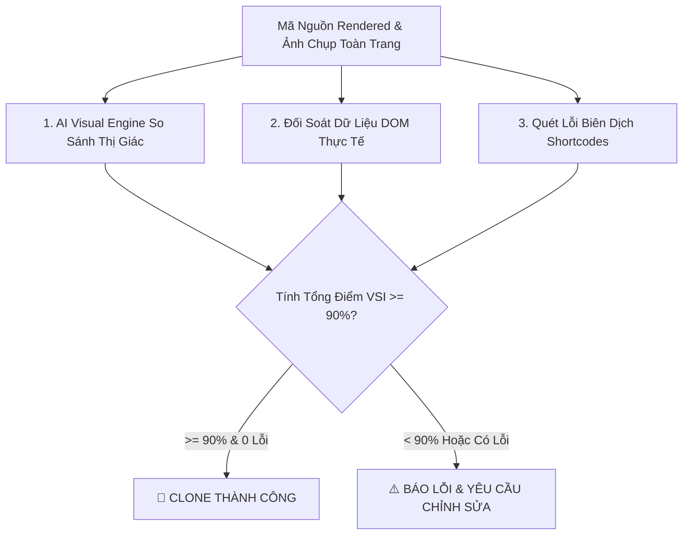

# AI Visual Recheck & Quality Assurance Skill (`recheck-url.py`)

## 1. Giới Thiệu
Skill **`recheck-url.py`** là hệ thống kiểm định chất lượng AI & so sánh đối chiếu thị giác trực quan (**AI Visual Comparison Engine**) giữa **Web Gốc (Source)** và **Web Clone (Target)** trên WordPress.

**Quy tắc Nghiệm Thu Cốt Lõi:**
> 🎯 **Độ tương đồng thị giác & cấu trúc phải ĐẠT TỪ 90% TRỞ LÊN (>= 90%) thì mới được xác nhận là "CLONE THÀNH CÔNG".**

---

## 2. Các Trụ Cột Đánh Giá Chất Lượng Của AI



### 1. **AI Visual Comparison (So Sánh Hình Ảnh Thị Giác - 100 Điểm)**
- **Độ tương đồng màu sắc & Palette (40%)**: Phân tích Histogram Cosine Similarity để đối chiếu bảng màu chủ đạo và nền giữa 2 trang.
- **Độ cân đối bố cục & Layout Blocks (35%)**: So sánh tỷ lệ chiều cao, khoảng cách padding, phân bổ các khối nội dung.
- **Độ khớp chi tiết Pixel (25%)**: Quét chênh lệch pixel qua thuật toán ImageChops và xuất **Bản đồ sai khác nhiệt (Visual Diff Heatmap)**.

### 2. **Kiểm Tra Tính Toàn Vẹn Frontend & Shortcodes**
- **0 Unparsed Shortcodes**: Đảm bảo không còn bất kỳ shortcode thô nào (`[vbc_...]`, `[row]`, `[col]`, `[accordion]`) bị lộ ra ngoài HTML.
- **0 Corrupted Style Tags**: Đảm bảo thẻ `<style>` không bị `wpautop` của WordPress tự ý chèn thẻ `<p>` hoặc `<br>`.
- **100% Hình Ảnh Rendered Hợp Lệ**: Không có thẻ `` rỗng `src=""`, ảnh có gắn `loading="eager" decoding="sync"`.
- **Cấu Trúc Hero & Form Chuẩn**: Có đầy đủ thẻ `<h1>`, hotline `tel:`, và form Contact Form 7 hoạt động tốt.

---

## 3. Hướng Dẫn Sử Dụng CLI

### A. Kiểm tra URL đã xuất bản kèm đối chiếu Web Gốc:
```bash
python skills/recheck-url.py --url "https://ultimateflatsomevibecode.s172d211.wpcloud.vn/tieng-trung-moc-ca-hi/" --source_url "https://nihaoma-mandarin.com/vi/trang-chu/" --threshold 90.0
```

### B. So sánh trực tiếp 2 ảnh chụp màn hình bằng AI Engine:
```bash
python skills/recheck-url.py --url "https://my-site.vn/clone/" --source_img "tmp/source_full.png" --target_img "tmp/clone_full.png" --threshold 90.0
```

---

## 4. Bảng Tham Số CLI

| Tham Số | Bắt Buộc | Mặc Định | Ý Nghĩa |
| :--- | :---: | :---: | :--- |
| `--url` | **Có** | - | URL trang web clone cần kiểm định chất lượng |
| `--source_url` | Không | `None` | URL trang web gốc để tự động đối chiếu |
| `--source_img` | Không | `None` | Đường dẫn ảnh chụp toàn trang của web gốc |
| `--target_img` | Không | `None` | Đường dẫn ảnh chụp toàn trang của web clone |
| `--threshold` | Không | `90.0` | **Ngưỡng % tương đồng tối thiểu để tính là Clone Thành Công** |
| `--max_retries` | Không | `3` | Số lần tự động recheck lại nếu chưa đạt chuẩn |
| `--tmp_dir` | Không | `tmp/` | Thư mục lưu báo cáo `recheck_visual_ai_report.md` và ảnh diff |

---

## 5. Báo Cáo Sinh Ra Trong `tmp/`

Sau khi chạy kiểm định, hệ thống tự động sinh các file đối soát thị giác trong `tmp/{slug}/`:
1. `recheck_visual_ai_report.md` — Bảng đối soát chi tiết điểm số thị giác và kết luận nghiệm thu.
2. `visual_side_by_side.jpg` — Ảnh ghép trực quan 2 trang web đặt cạnh nhau để so sánh bằng mắt.
3. `visual_diff_heatmap.png` — Bản đồ sai khác trực quan làm nổi bật các điểm lệch màu/khối.
